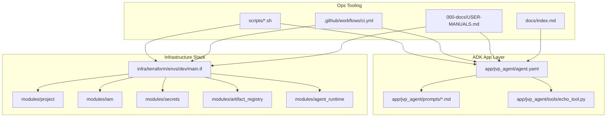

# 🤖 IAM JVP Base — Vertex AI Agent Engine Commander

<div align="center">

[](https://www.python.org/downloads/)
[](https://cloud.google.com/vertex-ai/agents/docs/adk/overview)
[](https://cloud.google.com/vertex-ai/generative-ai/docs/agents)
[](https://registry.terraform.io/providers/hashicorp/google/latest)
[](LICENSE)

**JVP (a.k.a. IAMJVP) is a brand-new strategic commander agent template built directly from Google’s latest ADK + Agent-to-Agent (A2A) rollout (released 6 days ago).**

[Quick Start](#-quick-start) • [Architecture](#-architecture) • [Features](#-key-capabilities) • [Terraform](#-terraform-baseline) • [Docs](#-documentation--manuals)

</div>

---

## 🎯 Mission

JVP demonstrates the minimal contract for a production-aligned command agent on Vertex AI Agent Engine:

- **ADK-first, zero legacy** — No LangChain, CrewAI, or bespoke frameworks.
- **A2A-ready** — Prompts and config prepared for the refreshed AgentCard + skills spec.
- **Infrastructure-aware** — Terraform modules mirror current Google guidance (project audit, IAM, Artifact Registry, Secret Manager, runtime placeholder).
- **Operator-friendly** — Scripts, CI, and docs point straight at the official user manuals bundled in this repo.

This template is a launchpad: extend the prompts, add tools, wire runtime, and ship a compliant Vertex AI commander.

---

## 🛠️ Key Capabilities

- ✅ **Fresh ADK scaffold** — `app/jvp_agent/agent.yaml` + prompts + echo tool for proof-of-life.
- ✅ **Strategy orchestration tool** — `strategic_orchestrator` blends local risk/opportunity heuristics for quick situational reads.
- ✅ **Protocol-conscious** — Comments surface TODO(ask) markers where the new manuals require confirmation (model selection, safety policies, CLI invocation).
- ✅ **Terraform baseline** — Modular layout with feature flags so you can enable resource provisioning incrementally.
- ✅ **CI + scripts** — Formatting, linting, Terraform init/fmt/validate, plus repo sanity checker for the canonical layout.
- ✅ **GitHub Pages ready** — `docs/index.md` mirrors this README so visitors see an immediate landing page.

---

## ⚡ Quick Start

### 1. Clone & install tooling

```bash
git clone https://github.com/<you>/intent-agent-model-jvp-base.git
cd intent-agent-model-jvp-base
pip install -r requirements.txt
```

### 2. Run local ADK dev server

```bash
./scripts/dev_run_adk.sh
# Serves the A2A endpoints via uvicorn on http://127.0.0.1:8080
# Visit /v1/card to inspect the AgentCard, or POST to /v1/message:send for commands.
```

### 3. Plan Terraform (dev environment)

```bash
cd infra/terraform/envs/dev
terraform init -backend=false
terraform plan -var-file=terraform.tfvars.example
```

Set flags in `terraform.tfvars` if you want Terraform to create the Artifact Registry, agent service account, or Secret Manager entries on the first run.

### 4. Build deployment artifacts

```bash
python scripts/package_agent.py
ls build/
# -> dependencies.tar.gz  pickle.pkl  requirements.txt
```

Artifacts land in `build/` and are consumed by Terraform or manual uploads.

### 5. Deploy to Vertex AI Agent Engine (manual trigger)

```bash
export VERTEX_PROJECT_ID=<project>
export VERTEX_LOCATION=<region>
export VERTEX_AGENT_ENGINE_ID=<agent-engine-id>
./scripts/deploy_agent_engine.sh
```

> CI/CD: Trigger the `deploy-agent-engine` workflow in GitHub Actions with the same values once Workload Identity Federation is configured.

---

## 🌐 Configure Environment Variables

Set these before running the agent to enable managed services:

| Variable | Description |
|----------|-------------|
| `VERTEX_PROJECT_ID` | Google Cloud project hosting Agent Engine + Vertex AI Search |
| `VERTEX_LOCATION` | Region (e.g., `us-central1`) |
| `VERTEX_AGENT_ENGINE_ID` | Agent Engine resource ID for sessions + memory bank |
| `VERTEX_SEARCH_DATA_STORE_ID` | Vertex AI Search datastore ID for RAG queries |

> TODO(ask): Confirm final naming conventions from the manuals; update this table if Google standardizes new variable names.

Without these variables, the agent falls back to in-memory session/memory services and the RAG tool returns a configuration warning.

---

## 🧠 Sessions & Memory

- The agent automatically loads prior memories via `PreloadMemoryTool` and persists sessions with `add_session_to_memory`, mirroring the ADK Cloud Run memory tutorial (`get_started_with_memory_for_adk_in_cloud_run.ipynb`).
- Provide `VERTEX_PROJECT_ID`, `VERTEX_LOCATION`, and `VERTEX_AGENT_ENGINE_ID` so the `CommandAgentExecutor` upgrades to `VertexAiSessionService` + `VertexAiMemoryBankService`; otherwise it uses in-memory fallbacks suited for local dev.
- When deploying with `adk deploy cloud_run`, pass `--session_service_uri="agentengine://<agent-engine-id>"` and `--memory_service_uri="agentengine://<agent-engine-id>"` to align with the tutorial’s guidance.
- `app/jvp_agent/memory.py` inspects the installed ADK at runtime and enables Context Cache + Events Compaction knobs (min_tokens=500, ttl=30m, reuse=10, compaction interval=5, overlap=1) whenever the SDK exposes them, keeping compatibility with older builds.

| Feature | Component | Parameter | Value | Purpose |
|---------|-----------|-----------|-------|---------|
| Context caching | `ContextCacheConfig` | `min_tokens` | 500 | Only cache large requests |
| Context caching | `ContextCacheConfig` | `ttl_seconds` | 1800 | Expire cache entries after 30 min |
| Context caching | `ContextCacheConfig` | `cache_intervals` | 10 | Refresh after 10 reuses even if TTL not reached |
| Context compression | `EventsCompactionConfig` | `compaction_interval` | 5 | Summarize history every 5 events |
| Context compression | `EventsCompactionConfig` | `overlap_size` | 1 | Keep 1 prior event for continuity |

---

## 🧩 Commander Components

- `app/jvp_agent/agent.py` — Defines the ADK `Agent` with prompts + Vertex AI memory callback wiring (falls back to in-memory if env vars missing).
- `app/jvp_agent/a2a.py` — Builds the AgentCard, exposes the `CommandAgentExecutor`, and wires the `A2aAgent`. Uses Vertex AI Session + Memory Bank when env vars are set.
- `app/jvp_agent/tools/echo_tool.py` — Placeholder command router that echoes structured payloads.
- `app/jvp_agent/tools/rag_search.py` — Vertex AI Search tool returning knowledge-grounded snippets (requires datastore configuration).
- `app/jvp_agent/tools/strategic_orchestrator.py` — Local heuristics for balancing risks and opportunities without external dependencies.
- `app/main.py` — Boots the A2A Starlette app via `uvicorn` for local testing.
- `scripts/deploy_agent_engine.sh` — Wrapper around the ADK CLI to deploy the agent to Vertex AI Agent Engine (mirrors the GitHub Actions workflow).

Use these modules as extension points when adding real tools, routing logic, or cross-agent delegation.

---

## 🧠 Architecture



**Extension Points**

- Add additional tools under `app/jvp_agent/tools/`.
- Extend AgentCard + skills once the official A2A schema section in the manuals is confirmed.
- Implement runtime resources (Cloud Run, API Gateway, etc.) inside `modules/agent_runtime`.

---

## 📦 Repository Layout

```
.
├── app/                      # ADK application (JVP)
│   └── jvp_agent/
│       ├── agent.yaml        # ADK config (model, tools, runtime)
│       ├── prompts/          # System / developer / user prompts
│       └── tools/            # Proof-of-life tool (echo) + future skills
├── infra/terraform/          # Modular Terraform baseline + envs/dev wiring
├── scripts/                  # Repo checks, dev runner stub, format/lint helper
├── 000-docs/                 # Internal manuals & project docs (Filing System v2.0)
├── docs/                     # GitHub Pages snapshot (public landing)
├── _archive/                 # Legacy workflows retained with NOTE
├── AGENTS.md                 # Contributor guide targeted at this layout
├── STATUS.md                 # Current state + TODO(ask) tracker
└── README.md                 # You are here
```

---

## ☁️ Terraform Baseline

- `modules/project` — Reads project metadata; placeholder for billing/API enablement.
- `modules/iam` — Optional service account provisioning (off by default).
- `modules/artifact_registry` — Creates Docker repo with immutable tags (toggle via variable).
- `modules/secrets` — Secret Manager baseline with user-managed replicas.
- `modules/agent_runtime` — Placeholder for Cloud Run / Gateway resources (fill once decided).
- `envs/dev` — Wires modules together for the dev environment, exposes feature flags, and includes sample `terraform.tfvars` + remote-state template.

CI runs `terraform init -backend=false`, `fmt`, and `validate` on every push via `.github/workflows/ci.yml`.

---

## 🔍 Tooling & CI

- `scripts/fmt_vet_lint.sh` — Runs `black`, `ruff` (if installed), and Terraform init/fmt/validate.
- `scripts/repo_repurpose_check.sh` — Verifies directory expectations and flags strays (e.g., leftover `.venv`).
- `scripts/dev_run_adk.sh` — Launch helper for the ADK/A2A dev server (currently `python -m app.main` via uvicorn).
- `.github/workflows/ci.yml` — Unified pipeline built around the scripts with an extra hook reserved for ADK YAML validation once the CLI ships an official checker.

---

## 📚 Documentation & Manuals

- **Local manuals:** `000-docs/USER-MANUALS.md` → points to the Vertex AI ADK notebooks and guides bundled in this repo.
- **Latest release notes:** `000-docs/008-AT-RELE-iamjvp-launch.md`.
- **External references:**
  - ADK Overview — https://cloud.google.com/vertex-ai/agents/docs/adk/overview
  - Agent Engine — https://cloud.google.com/vertex-ai/generative-ai/docs/agents
  - Terraform Google Provider — https://registry.terraform.io/providers/hashicorp/google/latest
  - A2A Protocol reference — consult the updated notebook in `000-usermanuals/`
  - Sessions & Memory Bank — https://cloud.google.com/vertex-ai/generative-ai/docs/agent-engine/memory-bank/overview
  - Vertex AI Search (App Builder) — https://cloud.google.com/generative-ai-app-builder/docs
  - Multi-agent template (Google) — https://github.com/GoogleCloudPlatform/generative-ai/blob/main/agents/agent_engine/tutorial_multi_agent_systems_on_vertexai_with_claude.ipynb

> ℹ️ When instructions conflict or are unclear, annotate the code with `// TODO(ask): ...` and log the question in `STATUS.md`. That keeps the baseline honest until the manuals provide a definitive answer.

---

## 🛣️ Roadmap

- [ ] Confirm Gemini model + safety policy per the post-rollout manual.
- [ ] Replace ADK CLI placeholder with official `adk api_server` command and add YAML validation step in CI.
- [ ] Flesh out AgentCard + skills for the refreshed A2A schema to advertise commander capabilities.
- [ ] Implement runtime resources (Cloud Run + API Gateway) once the deployment target is locked.
- [ ] Add unit/integration tests under `tests/` (mirroring `app/` layout) as behaviors grow beyond the echo tool.

Progress and questions are tracked in [`STATUS.md`](STATUS.md).

---

## 🤝 Contributing & Usage

1. Fork / clone this repo.
2. Align with the filing system (all docs in `000-docs/` using the NNN-CC-ABCD naming convention).
3. Update TODO markers only after verifying guidance in the manuals.
4. Run `./scripts/fmt_vet_lint.sh` before pushing.
5. Open PRs with context about which manual sections guided your change.

This baseline is meant to stay lean. Add only what the Google manuals or your production deployment truly require.

---

## 📣 Stay Updated

- Watch this repo for tags/releases as the official manuals evolve.
- Mirror updates into your own forks and document deviations in `STATUS.md`.
- Share improvements or questions via issues or discussions once they open.

---

**Status:** Initial launch • **Version:** 0.1.0 • **Last Updated:** 2025-11-17  
**Maintainer:** Intent Agent Model team (JVP Commander)

> Built from scratch on top of Google’s ADK + Vertex AI Agent Engine modernization (rolled out six days ago). Fork it, extend it, and command your agents with confidence.
